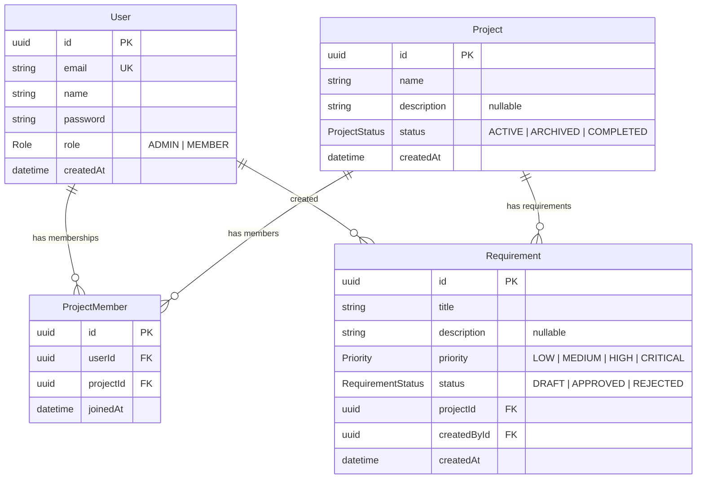

# Case Study – Entry-Level Backend Engineer

We are thrilled to have you join us as a potential candidate for the Backend student worker role. Welcome! You will participate in a group discussion designed to understand how you think about backend development. You will be working in small groups, where we encourage you to collaborate, share insights, and listen to different perspectives.

## Overview

This case study involves a **REST API** for a simple project requirements tracker. The application allows users to create projects, manage team membership, and track requirements within each project.

**Tech stack:** Node.js, TypeScript, Express, Prisma ORM, PostgreSQL

You can find the code in this repository.

## What to Expect

- **Familiarization:** You will be expected to familiarize yourself with the codebase before the discussion.
- **No Implementation:** You will **not** be required to write any code during the assessment. This is a discussion-based exercise.
- **Group Format:** You will discuss your observations in a small group.

## The Application

The API has the following resources:

| Resource | Description |
|---|---|
| **Users** | People who use the system. Have a global role (Admin or Member). |
| **Projects** | Containers for related requirements. Have a status (Active, Archived, Completed). |
| **Project Members** | Links users to projects they belong to. |
| **Requirements** | Individual items tracked within a project. Have a priority and status. |

### API Endpoints

**Users**
- `POST /api/users` — Create a new user
- `GET /api/users` — List all users
- `GET /api/users/:id` — Get a user by ID
- `DELETE /api/users/:id` — Delete a user

**Projects**
- `POST /api/projects` — Create a new project
- `GET /api/projects` — List all projects
- `GET /api/projects/:id` — Get a project with members and requirements
- `PUT /api/projects/:id` — Update a project
- `DELETE /api/projects/:id` — Delete a project
- `POST /api/projects/:id/members` — Add a member to a project
- `DELETE /api/projects/:id/members/:userId` — Remove a member

**Requirements**
- `POST /api/requirements/project/:projectId` — Create a requirement
- `GET /api/requirements/project/:projectId` — List requirements for a project
- `PUT /api/requirements/:id` — Update a requirement
- `DELETE /api/requirements/:id` — Delete a requirement
- `PATCH /api/requirements/bulk-status` — Bulk update requirement statuses

### Authentication

The API uses a simplified authentication mechanism: an `x-user-id` header identifies the current user. Some endpoints require authentication, some do not.

## Setup Instructions

See [README.md](./README.md) for instructions on how to run the application locally.

## Database ER Diagram

## Discussion Points

- Choices Made in the Implementation: Analyzing the decisions taken during the development of the application.
- Potential Improvements: Identifying opportunities to enhance the current implementation.
- Shortcomings: Discussing any weaknesses or limitations in the code.
- Extending Functionality: Exploring ways to add new features or improve existing ones.

We look forward to your insights and contributions during the assessment, Good Luck!